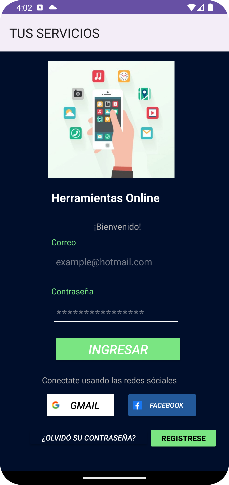

# Dispositivos móviles App
Esta es una aplicación que recopila una serie de funcionalidades estudiadas durante el semestre, con el fin de aprender la mayor cantidad de recursos que podemos utilizar para desarrollar una aplicación móvil con un fin específico. Estas funcionalidades se organizaron de manera secuencial para una mayor facilidad al momento de probarlas.
## Librería Usadas
- Firebase
  
Permite la autenticación de usuarios de diversas plataformas como Google y Facebook.

Por lo que para usar ese servicios es necesario vincular el proyecto con los servicio de Google y de Meta respectivamente.
  
- Google Play SDK.

Permite el uso de sus servicios con usuarios ya existentes y brinda una gran libertad al momento de usar sus servicios como herramientas de autenticacion.
 
- Facebook SDK.

Facebook impone el uso de usuarios de prueba en aplicacion no verificadas, ademas de exigir a quienes lo implementen tener pruebas con casos de uso para usar su servicios para el desarrollo de aplicaciones.
 
- Retrofit
- Arquitectura de Componentes de Android (ViewModel, LiveData).
- Corrutinas.
- Glide.
- Picasso.

## Funcionalidades de la aplicación.
- Registro e ingreso al aplicativo mediante el uso de Google, Facebook y Firebase.
- Conexión con Marvel API para búsqueda y consulta de personajes.
- Búsqueda simple y con comando de voz a través de Google.
- Localización del usuario en tiempo real con alta precisión en Google Maps. 
- Alarma con notificaciones. 
- Cámara que permite compartir las imágenes capturadas.

## Resultados
|||| ||
|----------|:-------------:|:-------------:|:-------------:|:-------------:|

||||| |
|----------|:-------------:|:-------------:|:-------------:|:-------------:|

||||
|----------|:-------------:|:-------------:|

## Checkout
[Dispositivos móviles App](https://github.com/GeoWillC/Dispositivos_moviles_proyecto_gc_es)

## Colaboradores.
- Conlago George - Desarrollador de Android -[Perfil de GitHub](https://github.com/GeoWillC)
- Solano Erick - Desarrollador de Android -[Perfil de GitHub](https://github.com/easolano98)

## Licencia

Licencia MIT

Derechos de Autor (c) 2020 Shrikanth Ravi

Por la presente se otorga permiso, de forma gratuita, a cualquier persona que obtenga una copia de este software y los archivos de documentación asociados (el "Software"), para tratar con el Software sin restricciones, incluidos, entre otros, los derechos de usar, copiar, modificar, fusionar, publicar, distribuir, sublicenciar y / o vender copias del Software, y permitir a las personas a las que se les proporcione el Software hacer lo mismo, sujeto a las siguientes condiciones:

El aviso de derechos de autor anterior y este aviso de permiso deben incluirse en todas las copias o porciones sustanciales del Software.

EL SOFTWARE SE PROPORCIONA "TAL CUAL", SIN GARANTÍA DE NINGÚN TIPO, EXPRESA O IMPLÍCITA, INCLUYENDO PERO NO LIMITADO A LAS GARANTÍAS DE COMERCIABILIDAD, APTITUD PARA UN PROPÓSITO PARTICULAR Y NO INFRACCIÓN. EN NINGÚN CASO LOS AUTORES O TITULARES DE LOS DERECHOS DE AUTOR SERÁN RESPONSABLES DE CUALQUIER RECLAMO, DAÑO U OTRA RESPONSABILIDAD, YA SEA EN UNA ACCIÓN DE CONTRATO, AGRAVIO U OTRO MOTIVO, DERIVADA DE, FUERA DE O EN CONEXIÓN CON EL SOFTWARE O EL USO U OTRAS ACCIONES EN EL SOFTWARE.pero no se limita a, la venta del Software, servicios relacionados o productos que incorporen el Software de manera directa o indirecta.
El aviso de derechos de autor anterior y este aviso de permiso deberán incluirse en todas las copias o porciones sustanciales del Software.
EL SOFTWARE SE PROPORCIONA "TAL CUAL", SIN GARANTÍA DE NINGÚN TIPO, EXPRESA O IMPLÍCITA, INCLUYENDO, PERO NO LIMITADO A, LAS GARANTÍAS DE COMERCIABILIDAD, APTITUD PARA UN PROPÓSITO PARTICULAR Y NO INFRACCIÓN. EN NINGÚN CASO LOS AUTORES O TITULARES DE LOS DERECHOS DE AUTOR SERÁN RESPONSABLES DE CUALQUIER RECLAMO, DAÑO U OTRA RESPONSABILIDAD, YA SEA EN UNA ACCIÓN DE CONTRATO, AGRAVIO O DE OTRO MODO, DERIVADA DE, FUERA DE O EN CONEXIÓN CON EL SOFTWARE O EL USO U OTRAS ACCIONES EN EL SOFTWARE.

